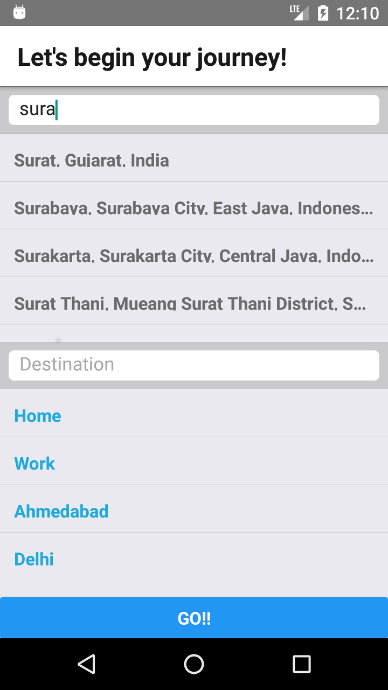

Directions - Mapbox - Mobile - App
============

A react-native app with backend code for using the mapbox api to allow user to choose source and destination and show the directions and travel time using Google Maps interface.

# Home Screen


# Map View


# Prerequisites

* Go through the facebook's [React-native][1] document to setup basic requirements for react native project
* This project is made from ```react-native init``` method.
* Make sure you have *npm* and *node* installed in your system.

# Libraries used 

* [React Native Maps][2] used to show google maps in the react native apps .
* [React Native Map Directions][3] to show the polyline between two places in the map.
* [React Native Auto Complete Places][4] to show places while choosing source and destination.
* [Axios][5] A Promise based HTTP client for the browser and node.js.

Dont worry you won't have to add all the libraries seperately, go through the installation process below and follow the steps to get your project running.

# Api's to be configured
* Google Maps Api for geolocation:  ```https://developers.google.com/maps/documentation/android-api/start``` add this api in android/app/src/main/AndroidManifest.xml
``` 
  <uses-permission android:name="android.permission.ACCESS_FINE_LOCATION" />
    <application>
       <meta-data
          android:name="com.google.android.geo.API_KEY"
          android:value="ADD GOOGLE MAPS API"/>
    </application>
    
 ```
* Google places Api for autocomplete places : ```https://developers.google.com/places/android-api/autocomplete``` add this to the file react-native/components/Mapshow.js
```
const GOOGLE_MAPS_APIKEY = 'GOOGLE PLACES API HERE';
```


# Installation

1. Clone the project from hasura following [Quickstart][6]    
2. Go to react-native directory in the project and open terminal in that directory and give ```npm install``` to install all the libraries to the project
3. Don't forget to link the dependencies with ```react-native link``` 
4. Run this app by ```react-native run-android```.

# Building the apk

1. For an unsigned apk bundle your js and then generate the apk
``` 
react-native bundle --dev false --platform android --entry-file index.js --bundle-output ./android/app/build/intermediates/assets/debug/index.android.bundle --assets-dest ./android/app/build/intermediates/res/merged/debug
```
```
cd android/ && ./gradlew assembleDebug
```

2. For generating a signed apk just go through the documentation [Building a signed apk][7] by facebook.
3. Once you are done with the editing the gradle files and keystore just run below command to get an apk ready to be publish to Play store.
```
cd android && ./gradlew assembleRelease
```


[1]: https://github.com/facebook/react-native
[2]: https://github.com/react-community/react-native-maps
[3]: https://github.com/bramus/react-native-maps-directions
[4]: https://github.com/FaridSafi/react-native-google-places-autocomplete
[5]: https://github.com/axios/axios
[6]: https://docs.hasura.io/0.15/manual/hasuractl/hasura_quickstart.html
[7]: https://facebook.github.io/react-native/docs/signed-apk-android.html
